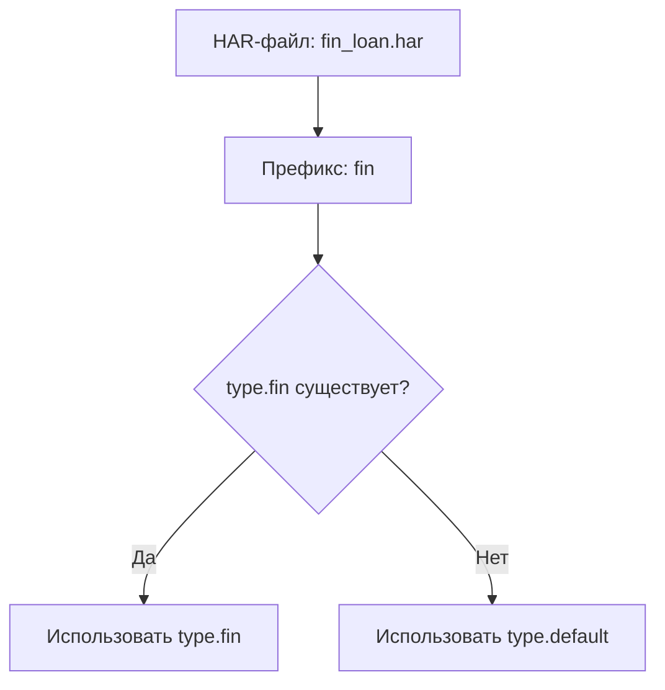

# msw-har

Утилита для генерации MSW-моков из HAR-файлов. Преобразует записанный трафик (HAR) в структуру JSON-файлов и `handlers.js` с обработчиками [Mock Service Worker](https://mswjs.io/), которые можно поднять как единый сервер.

## Использование

```bash
# Интерактивный выбор HAR-файла из harDir и запуск пайплайна
npx msw-har -gen

# Прямой путь к HAR-файлу (тип определяется по префиксу имени)
npx msw-har source/jrpc_newbie-ea.har

# Запуск сервера со всеми моками из mockDir
npx msw-har
```

### Справка

```bash
npx msw-har -h
```

## Конфигурация

В корне проекта создаётся файл **`msw-har.config.js`** — ES-модуль с `default export`.
например: 
```js
import path from "node:path";
import { fileURLToPath } from "node:url";

const __dirname = path.dirname(fileURLToPath(import.meta.url));

export default {
    type: {
        default: {
            entryRequestUrl: "/rpc",
            rpcMethod: true,
            sessionCookie: true,
            state: [
                {
                    name: "status",
                    type: "path",
                    path: "result.data.loan_application.status",
                    nullCheckMethods: ["getStatus"]
                }
            ]
        },
        fin: {
            entryRequestUrl: "/public_api",
            state: [
                {
                    name: "step",
                    type: "path",
                    path: "step",
                    value: "CpaClickStep",
                    initial: true
                }
            ]
        }
    },
    harDir: path.resolve(__dirname, "./e2e-test-results/har/"),
    mockDir: path.resolve(__dirname, "./e2e/mock-data/"),
}
```

### Корневые поля

| Поле       | Тип     | По умолчанию | Описание                                                                 |
|------------|---------|--------------|--------------------------------------------------------------------------|
| `type`     | `object`| —            | Секция с конфигурациями по именам типов. Каждое значение — объект типа. |
| `harDir`   | `string`| `./source`   | Папка с HAR-файлами для интерактивного выбора (`-gen`).                  |
| `mockDir`  | `string`| `./mocks`    | Папка, куда сохраняются сгенерированные моки.                            |

### Секция `type`

Объект, ключи которого — имена типов. Имя типа определяется по **префиксу имени HAR-файла** (часть до первого `_`). Например, файл `jrpc_newbie-ea.har` → тип `jrpc`. Если подходящего ключа нет — используется `type.default`.

Имя типа можно также передать явно флагом `-type` при запуске скриптов напрямую.

#### Выбор типа



### Параметры типа

Каждый тип (значение в секции `type`) поддерживает следующие поля:

#### `entryRequestUrl`

- **Тип:** `string`
- **Обязательно:** да

Базовый URL, по которому фильтруются запросы из HAR. Только запросы, URL которых содержит это значение, попадают в моки.

```js
entryRequestUrl: "/rpc"         // JSON-RPC endpoint
entryRequestUrl: "/public_api"  // REST API endpoint
```

#### `rpcMethod`

- **Тип:** `boolean`
- **По умолчанию:** `false`

Включает режим JSON-RPC. Когда `true`:

- Запросы группируются не только по URL, но и по полю `method` в теле запроса (json-rpc method).
- В обработчиках появляется парсинг `request.json()` и проверка `body.method === "..."`.
- При дедупликации из тел запросов и ответов удаляется поле `id` (json-rpc идентификатор).

```js
rpcMethod: true   // JSON-RPC: /rpc с body.method
rpcMethod: false  // REST: разные URL для разных запросов
```

#### `sessionCookie`

- **Тип:** `boolean`
- **По умолчанию:** `false`

Включает поддержку сессий через cookie `mock-session`. Каждая сессия имеет независимое состояние `state`. Когда `false` — используется единый глобальный `state` без изоляции.

При `true` в `handlers.js` генерируется:
- `Map` сессий, keyed by `sessionId`
- Функция `getSession(request)` — читает `x-mock-session` из заголовков или создаёт новую сессию
- Функция `respond(json, sessionId)` — добавляет `x-mock-session` в заголовки ответа
- Сервер (`server-all.js`) автоматически преобразует cookie ↔ заголовок

```js
sessionCookie: true   // каждая сессия — независимое состояние
sessionCookie: false  // единое глобальное состояние
```

#### `checkRaceCondition`

- **Тип:** `[number, number] | undefined`
- **По умолчанию:** `undefined` (без задержки)

Добавляет случайную задержку перед возвратом ответа в каждом обработчике для симуляции race condition. Значения — секунды: `[min, max]`.

```js
checkRaceCondition: [0, 4]  // случайная задержка 0–4 секунды
```

#### `state`

- **Тип:** `Array<StateConfig>`
- **По умолчанию:** `[]`

Массив описаний переменных состояния. Позволяет разводить дубликаты запросов по контексту: один и тот же запрос может вернуть разные ответы в зависимости от текущего состояния (статус заявки, факт авторизации и т.д.).

Поддерживается два типа состояния:

---

##### `type: "path"` — значение из ответа

Читает значение по dot-нотации из тела ответа и использует его как переменную состояния. При смене значения — предыдущей записи в `calling-order.json` добавляется команда `set_<name>` (ответ текущего запроса переводит приложение в новое состояние).

| Поле                | Тип       | Описание                                                                                          |
|---------------------|-----------|--------------------------------------------------------------------------------------------------|
| `name`              | `string`  | Имя переменной состояния (используется в условиях `state.<name>`).                              |
| `type`              | `string`  | `"path"`                                                                                         |
| `path`              | `string`  | Dot-нотация пути в теле ответа, например `"result.data.loan_application.status"`.               |
| `value`             | `any`     | Начальное значение. Используется только если `initial: true`.                                    |
| `initial`           | `boolean` | Если `true` — состояние инициализируется значением `value`. Если `false` — начинается как `null`. |
| `nullCheckMethods`  | `string[] \| null` | Список rpc-методов, для которых обновление состояния разрешено даже если значение по пути `null`. Для остальных методов `null` игнорируется. Защищает от ложных сбросов состояния, когда метод возвращает `null` в ответе. |

```js
{
    name: "status",
    type: "path",
    path: "result.data.loan_application.status",
    nullCheckMethods: ["getStatus"]
}
```

> `nullCheckMethods`: если ответ метода `getRates` содержит `null` по пути `result.data.status`, состояние **не** сбросится. Но если `getStatus` вернёт `null` — состояние обновится на `null`, т.к. метод входит в список.

---

##### `type: "rpcMethodTrigger"` — переключение по RPC-методу

Устанавливает переменную состояния, когда приходит запрос с определённым JSON-RPC методом. Команда `set_<name>` устанавливается на самой триггер-записи (а не на предыдущей, как у `path`).

| Поле        | Тип       | По умолчанию | Описание                                                            |
|-------------|-----------|--------------|---------------------------------------------------------------------|
| `name`      | `string`  | —            | Имя переменной состояния.                                          |
| `type`      | `string`  | —            | `"rpcMethodTrigger"`                                               |
| `rpcMethod` | `string`  | —            | Имя JSON-RPC метода, который переключает состояние.                |
| `value`     | `any`     | `true`       | Значение, которое устанавливается при срабатывании триггера.       |
| `initial`   | `any`     | `false`      | Начальное значение переменной.                                     |

```js
{
    name: "auth",
    type: "rpcMethodTrigger",
    rpcMethod: "auth",
    value: true,
    initial: false
}
```

> После запроса с `body.method === "auth"` переменная `state.auth` становится `true`. Все последующие записи получают `state.auth: true` в `calling-order.json`, что позволяет возвращать разные ответы для авторизованных и неавторизованных запросов.

---

### Как работает `state` в генерируемых обработчиках

Сгенерированный `handlers.js` содержит цепочку `if`-условий для каждого варианта ответа:

```js
if (state.status === "DRAFT" && body.method === "getRates") {
    const json = (await import("./rates/post/getRates/response-result-1.json", { with: { type: "json" } })).default;
    state.status = "APPROVED";
    return respond(json, sessionId);
}
if (state.status === "APPROVED" && body.method === "getRates") {
    const json = (await import("./rates/post/getRates/response-result-2.json", { with: { type: "json" } })).default;
    return respond(json, sessionId);
}
```

Условие строится из:
- **state-проверок** — `state.<name> === <value>` (все поля `state` в `calling-order.json`, кроме `set_*`)
- **rpcMethod-проверки** — `body.method === "..."` (если включён `rpcMethod: true`)

После срабатывания условия выполняются **set-команды** — `state.<name> = <value>` (поля `set_<name>` из `calling-order.json`).

